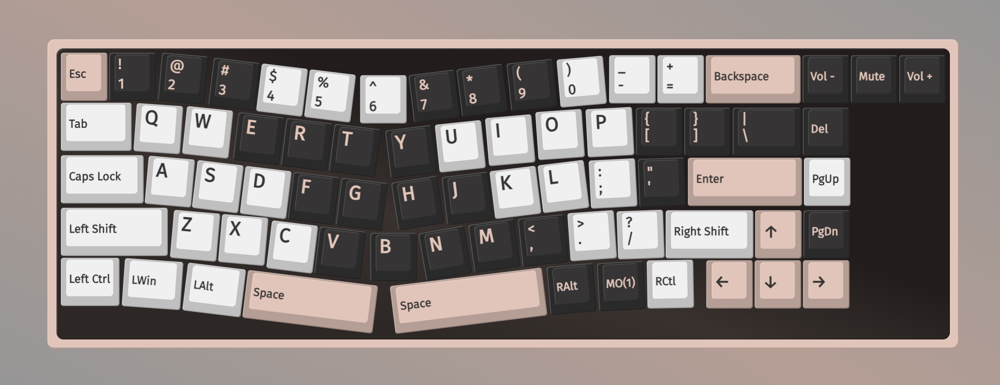

# A-Jazz/Attack Shark/Mambasnake AKS068 QMK/VIA .json Files

I originally bought this keyboard on [Amazon](https://www.amazon.com/dp/B0CRVR1X8N) under the name "ATTACK SHARK AKS068". The product description points to bit.ly/AKS068SOFT to download the VIA json file to get this keyboard working on VIA, but that file has a bunch of weird formatting and errors.

I cleaned it up a bit and was able to successfully use it to remap the keyboard on my MacOS. Hopefully this shows up when people google `AKS068 VIA` since the download on A-Jazz's website is pretty shady.